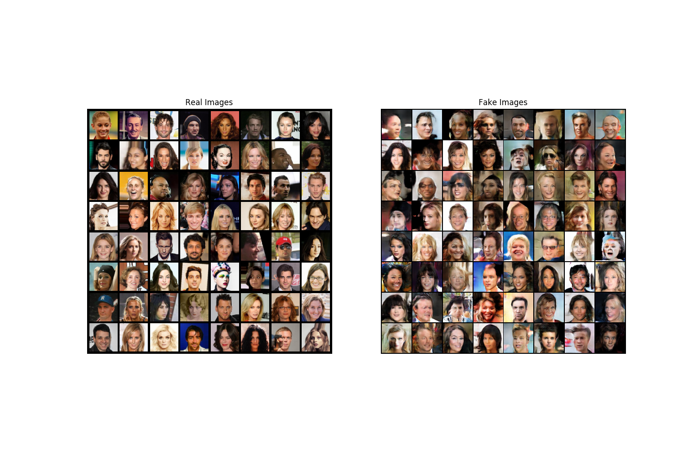

# Generate fake celebrities faces
Mainly inspired of [this work](https://research.nvidia.com/sites/default/files/pubs/2017-10_Progressive-Growing-of/karras2018iclr-paper.pdf) from NVIDIA, and [this tutorial](https://pytorch.org/tutorials/beginner/dcgan_faces_tutorial.html) from pyTorch, thanks to them.

## Set-up
First, you'll need to download the [dataset CelebA](https://www.kaggle.com/jessicali9530/celeba-dataset/version/2) (kaggle link, thanks to Jessica Li, make sure it is still up to date) and to uncompress it into the `dataset` folder (also uncompress the images subdirectory).  
Also, `easydict` is needed for the configuration file.

## Progress
### Torch version
Works fine, a bit slow on CPU, but it's normal.. ~11h for 5 epochs, results below:  


### Tensorflow version
Somehow doesn't work, crashes when I call the xavier initializer, or even any `tf.contrib.layer`, I can reproduce:
```python3
import tensorflow
from tensorflow.contrib import layer
```
Must be installation issue, but the same happens in a fresh virtualenv. I should investigate.