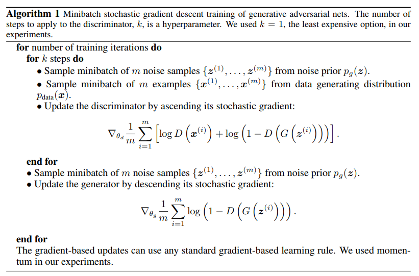

# Useful documentation and annotations

## [Generative Adversalial Nets](https://arxiv.org/pdf/1406.2661.pdf)
  
A few of the problems GANs often encounter:
- Non-convergence: weights of the model oscillate forever, no convergence to the Nash equilibrium
- Mode collapse: G failed to be diverse, and limits itself to a small number of samples
- Diminished gradient: when D is to strong compared to G -> So G learns nothing, which leads to overfitting
- They are highly dependant / sensitive to the hyperparameters

## [DCGANS - Unsupervised Representation Learning with Deep Convolutional Generative Adversarial Networks](https://arxiv.org/pdf/1511.06434.pdf)
Improvement to CNN architecture, three core differences:
- 1) All convolutional net (Springenberg et al., 2014) which replaces deterministic spatial pooling functions (such as maxpooling) with strided convolutions, allowing the network to learnits own spatial downsampling.
- 2) Eliminates all fully connected layers on top of convolutional features. Replaces by global average pooling, which increases the model stability but decreases convergence speed.
- 3) Batch Normalization (Ioffe & Szegedy, 2015) to stabilize learning by normalizing the input to each unit to have zero mean and unit variance.

## [CSN229 from Andrew Ng](http://cs229.stanford.edu/notes/cs229-notes2.pdf)
READING IN PROGRESS
- Instead of classifying things as belonging to category 1, 2, .. n, we build models defining what category 1, 2, .. n look like, and then see where things belong the most.
..- Note: something belonging to none still belongs to portion of them. Meaning: if 80% cat, 70% tiger, 10% dog => new category n+1 = some feline?

## [CS231 by Fei Fei Li](http://cs231n.stanford.edu/slides/2017/cs231n_2017_lecture13.pdf)
TO READ

## [Understand more about generative / discrimative classifiers](http://www.cs.cmu.edu/~aarti/Class/10701/readings/NgJordanNIPS2001.pdf)
TO READ

## [DeepMind Slides on GAN from Balaji Lakshminarayanan](http://www.gatsby.ucl.ac.uk/~balaji/Understanding-GANs.pdf)
CLEARLY NEED TO READ THIS AGAIN
- During training; both the Discriminator and Generator are trying to optimize opposite loss functions
..- = two agents playing a minimax game with value function V(G,D)
..- = G tries to MAXimize the probability of having its outputs recognized as real
..- = D tries to MINimize this same value
- Same Loss function L used for both, but:
..- D -> argmin L
..- G -> argmin -L

## [Final boss, mathematical details](https://lilianweng.github.io/lil-log/2017/08/20/from-GAN-to-WGAN.html)
TO READ
