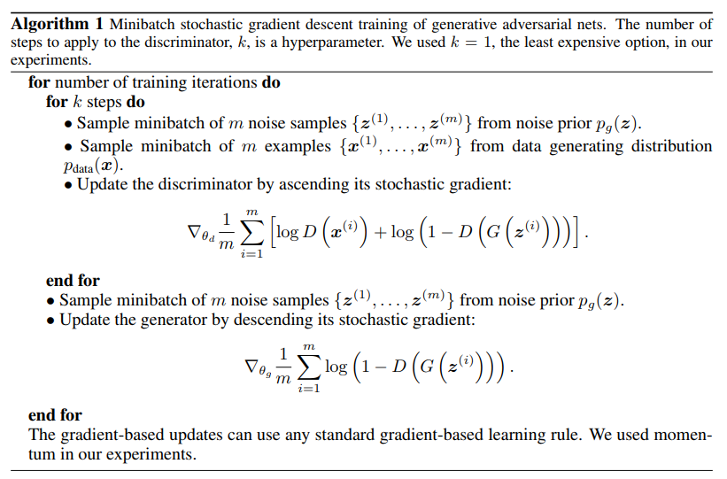

# Useful documentation and annotations

## [Generative Adversalial Nets](https://arxiv.org/pdf/1406.2661.pdf)

## [DeepMind Slides on GAN from Balaji Lakshminarayanan](http://www.gatsby.ucl.ac.uk/~balaji/Understanding-GANs.pdf)
CLEARLY NEED TO READ THIS AGAIN
- During training; both the Discriminator and Generator are trying to optimize opposite loss functions
..- = two agents playing a minimax game with value function V(G,D)
..- = G tries to MAXimize the probability of having its outputs recognized as real
..- = D tries to MINimize this same value
- Same Loss function L used for both, but:
..- D -> argmin L
..- G -> argmin -L
